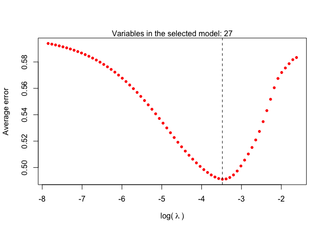

<!-- README.md is generated from README.Rmd. Please edit that file -->

# svyVarSel

<!-- badges: start -->
<!-- badges: end -->

This package allows to fit linear and logistic LASSO and elastic net
models to complex survey data.

This package depends on `survey` and `glmnet` packages.

Five functions are available in the package:

- `welnet`: This is the **main function**. This function allows to fit
  elastic net (linear or logistic) models to complex survey data
  (including ridge and LASSO regression models, depending on the
  selected mixing parameter), considering sampling weights in the
  estimation process and selecting the lambda that minimizes the error
  based on different replicate weights methods.
- `wlasso`: This function allows to fit LASSO prediction (linear or
  logistic) models to complex survey data, considering sampling weights
  in the estimation process and selecting the lambda that minimizes the
  error based on different replicate weights methods (equivalent to the
  `welnet()` function when `alpha=1`).
- `welnet.plot`: plots objects of class `welnet`, indicating the
  estimated error of each lambda value and the number covariates of the
  model that minimizes the error.
- `wlasso.plot`: plots objects of class `wlasso`, indicating the
  estimated error of each lambda value and the number covariates of the
  model that minimizes the error.
- `replicate.weights`: allows randomly defining training and test sets
  by means of the replicate weights’ methods analyzed throughout the
  paper. The functions `welnet()` and `wlasso()` depend on this function
  to define training and test sets. In particular, the methods that can
  be considered by means of this function are:
  - The ones that depend on the function `as.svrepdesign` from the
    `survey` package: Jackknife Repeated Replication (`JKn`), Bootstrap
    (`bootstrap` and `subbootstrap`) and Balanced Repeated Replication
    (`BRR`).
  - **New proposals:** Design-based cross-validation (`dCV`),
    split-sample repeated replication (`split`) and extrapolation
    (`extrapolation`).

## Installation

To install it from [CRAN](https://CRAN.R-project.org):

``` r
install.packages("svyVarSel")
```

To install the updated version of the package from GitHub:

``` r
devtools::install_github("aiparragirre/svyVarSel")
```

## Example

Fit a logistic elastic net model as follows:

``` r
library(svyVarSel)
data(simdata_lasso_binomial)

mcv <- welnet(data = simdata_lasso_binomial,
              col.y = "y", col.x = 1:50,
              family = "binomial",
              alpha = 0.5,
              cluster = "cluster", strata = "strata", weights = "weights",  
              method = "dCV", k=10, R=20)
```

Or equivalently:

``` r
mydesign <- survey::svydesign(ids=~cluster, strata = ~strata, weights = ~weights,
                              nest = TRUE, data = simdata_lasso_binomial)
mcv <- welnet(col.y = "y", col.x = 1:50, design = mydesign,
              family = "binomial", alpha = 0.5,
              method = "dCV", k=10, R=20)
```

Then, plot the result as follows:

``` r
welnet.plot(mcv)
```



If you only aim to obtain replicate weights for other purposes, use the
`replicate.weights()` function:

``` r
newdata <- replicate.weights(data = simdata_lasso_binomial,
                             method = "dCV",
                             cluster = "cluster",
                             strata = "strata",
                             weights = "weights",
                             k = 10, R = 20,
                             rw.test = TRUE)
```
